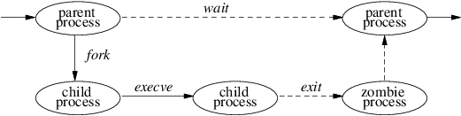

# 2.1.4.流程管理

4.4BSD 支持多任务环境。每个任务或执行线程被称为一个进程。4.4BSD 进程的上下文由用户级状态和内核级状态组成，前者包括其地址空间和运行时环境的内容，后者包括调度参数、资源控制和识别信息。上下文包括内核在为进程提供服务时所使用的一切。用户可以创建进程，控制进程的执行，并在进程的执行状态改变时收到通知。每个进程都被分配一个唯一的值，称为进程标识符（PID）。内核在向用户报告状态变化时使用这个值来识别进程，而用户在系统调用中引用一个进程时也使用这个值。

内核通过复制另一个进程的上下文来创建一个进程。新的进程被称为原父进程的子进程。在创建进程时复制的上下文包括进程的用户级执行状态和由内核管理的进程的系统状态。内核状态的重要组成部分将在第四章中描述。

流程生命周期

进程的生命周期在进程生命周期中得到了描述。一个进程可以通过使用 fork 系统调用创建一个新的进程，它是原始进程的副本。fork 调用返回两次：一次是在父进程中，返回值是子进程的标识符，另一次是在子进程中，返回值是0。 父子关系在系统中的进程集合上引起了一个层次结构。新进程共享其父进程的所有资源，如文件描述符、信号处理状态和内存布局。

尽管在某些情况下，新进程的目的是成为父进程的副本，但加载和执行一个不同的程序是一个更有用和更典型的动作。一个进程可以用另一个程序的内存映像覆盖自己，使用系统调用 execve 将一组参数传递给新创建的映像。其中一个参数是一个文件的名称，其内容是系统认可的格式--要么是一个二进制可执行文件，要么是一个导致执行指定解释器程序来处理其内容的文件。

一个进程可以通过执行 exit 系统调用来终止，向其父代发送 8 比特的退出状态。如果一个进程想与它的父进程交流超过一个字节的信息，它必须使用管道或套接字建立一个进程间交流通道，或者使用一个中间文件。进程间通信在第 11 章有广泛的讨论。

一个进程可以暂停执行，直到它的任何一个子进程使用 wait 系统调用终止，它返回被终止的子进程的 PID 和退出状态。当一个子进程退出或异常终止时，一个父进程可以安排通过信号来通知它。使用 wait4 系统调用，父进程可以检索有关导致子进程终止的事件和该进程在其生命周期内消耗的资源的信息。如果一个进程因为它的父进程在结束前退出而成为孤儿，那么内核会安排将子进程的退出状态传回给一个特殊的系统进程 init：见3.1和14.6节）。

关于内核如何创建和销毁进程的细节将在第5章给出。

进程是根据进程优先级参数来安排执行的。这个优先级由一个基于内核的调度算法管理。用户可以通过指定一个参数（nice）来影响进程的调度，该参数会对整个调度优先级进行加权，但仍有义务根据内核的调度策略来分享基础的CPU资源。

## 2.1.4.1.信号

系统定义了一组可能被传递给进程的信号。4.4BSD 的信号是以硬件中断为模型的。一个进程可以指定一个用户级子程序作为处理程序，将信号传递给它。当一个信号产生时，在处理程序捕捉它的过程中，它被阻止进一步发生。捕捉信号包括保存当前的进程上下文并建立一个新的上下文来运行处理程序。然后，信号被传递给处理程序，处理程序可以终止进程或返回执行进程（也许在设置全局变量后）。如果处理程序返回，信号就被解除封锁，并可以再次生成（和捕获）。

另外，一个进程可以指定一个信号被忽略，或者指定一个由内核决定的默认动作。某些信号的默认动作是终止进程。这种终止可能伴随着创建一个核心文件，该文件包含进程当前的内存映像，以便在死后调试时使用。

有些信号不能被捕捉或忽略。这些信号包括杀死失控进程的 SIGKILL，以及工作控制信号 SIGSTOP。

一个进程可以选择在一个特殊的堆栈上传递信号，这样就可以进行复杂的软件堆栈操作了。例如，支持循环程序的语言需要为每个循环程序提供一个堆栈。语言运行时系统可以通过分割 4.4BSD 提供的单一堆栈来分配这些堆栈。如果内核不支持单独的信号堆栈，那么为每个 coroutine 分配的空间必须按照捕捉信号所需的空间量来扩展。

所有的信号都有相同的优先级。如果多个信号同时挂起，信号被传递给进程的顺序是特定的实现。信号处理程序与导致其调用被阻塞的信号一起执行，但其他信号可能还会发生。提供了一些机制，使进程可以保护代码的关键部分，防止指定信号的发生。

信号的详细设计和实现将在第4.7节描述。

## 2.1.4.2.过程组和会议

进程被组织到进程组中。进程组被用来控制对终端的访问，并提供一种将信号分配给相关进程集合的方法。一个进程从其父进程中继承其进程组。内核提供了一些机制，允许进程改变其进程组或其后代的进程组。创建一个新的进程组是很容易的；一个新的进程组的值通常是创建进程的进程标识符。

一个用户进程可以向一个进程组中的每个进程发送信号，也可以向单个进程发送信号。一个特定进程组中的进程可以收到影响该组的软件中断，导致该组暂停或恢复执行，或被中断或终止。

一个终端有一个分配给它的进程组标识符。这个标识符通常被设置为与该终端相关的进程组的标识符。一个作业控制外壳可以创建许多与同一终端相关的进程组；该终端是这些组中每个进程的控制终端。只有当终端的进程组标识符与进程的标识符相匹配时，进程才能从其控制终端的描述符中读取。如果标识符不匹配，进程在试图从该终端读取时将被阻止。通过改变终端的进程组标识符，shell可以在几个不同的作业中仲裁一个终端。这种仲裁被称为工作控制，并在第 4.8 节中描述了进程组。

正如一组相关的进程可以被收集到一个进程组中一样，一组进程组可以被收集到一个会话中。会话的主要用途是为一个守护进程及其子进程创建一个隔离的环境，并将用户的登录 shell 和该 shell 产生的作业收集在一起。
