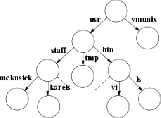

# 2.1.7. 文件系统

一个常规文件是一个线性的字节数组，可以从文件中的任何一个字节开始读写。内核在常规文件中不区分记录的边界，尽管许多程序将换行字符识别为区分行的末端，其他程序可能会施加其他结构。文件本身没有保存与系统有关的信息，但文件系统在每个文件中都存储了少量的所有权、保护和使用信息。

一个文件名组件是一个最多 255 个字符的字符串。这些文件名被存储在一种叫做目录的文件中。目录中关于一个文件的信息被称为目录条目，除了文件名之外，还包括一个指向文件本身的指针。目录条目可以指向其他目录，也可以指向普通文件。这样就形成了一个目录和文件的层次结构，并被称为文件系统。

一个小型文件系统

一个小的文件系统显示在一个小的文件系统中。目录可以包含子目录，而且对目录嵌套的深度没有固有的限制。为了保护文件系统的一致性，内核不允许进程直接写入目录。一个文件系统不仅可以包括普通的文件和目录，还可以包括对其他对象的引用，如设备和套接字。

文件系统形成了一棵树，它的开始是根目录，有时用斜线这个名字来指代，用一个实体字符（/）来拼写。根目录包含文件；在图 2.2 的例子中，它包含 vmunix，一个内核可执行对象文件的副本。它还包含目录；在这个例子中，它包含 usr 目录。在 usr 目录下是 bin 目录，它主要包含程序的可执行目标代码，如 ls 和 vi 文件。

一个进程通过指定文件的路径名来识别一个文件，路径名是一个由零个或多个文件名组成的字符串，用斜线（/）字符隔开。内核将两个目录与每个进程联系起来，用于解释路径名。一个进程的根目录是该进程可以访问的文件系统的最顶端；它通常被设置为整个文件系统的根目录。一个以斜线开头的路径名被称为绝对路径名，内核从进程的根目录开始解释。

不以斜线开头的路径名被称为相对路径名，它被解释为相对于进程的当前工作目录。(这个目录也被称为较短的名称 current directory 或 working directory)。当前目录本身可以直接用点来指代，用一个句号(.)来拼写。文件名点点(.)指的是一个目录的父目录。根目录是它自己的父目录。

一个进程可以用 chroot 系统调用设置其根目录，用 chdir 系统调用设置其当前目录。任何进程都可以在任何时候进行 chdir 操作，但 chroot 只允许具有超级用户权限的进程使用。Chroot 通常用于设置对系统的限制性访问。

使用图 2.2 所示的文件系统，如果一个进程将文件系统的根作为它的根目录，并将 `/usr` 作为它的当前目录，它可以从根目录用绝对路径名 `/usr/bin/vi` 来引用文件 vi，或者从它的当前目录用相对路径名 `bin/vi` 来引用。

系统实用程序和数据库被保存在某些著名的目录中。定义明确的层次结构的一部分包括一个包含每个用户的主目录的目录--例如，图2.2中的 `/usr/staff/mckusick` 和`/usr/staff/karels`。当用户登录时，他们 shell 的当前工作目录被设置为主目录。在他们的主目录中，用户可以像创建普通文件一样容易地创建目录。因此，用户可以建立任意复杂的子层次结构。

用户通常只知道一个文件系统，但系统可能知道这一个虚拟文件系统实际上是由几个物理文件系统组成的，每个都在不同的设备上。一个物理文件系统可能不会跨越多个硬件设备。由于大多数物理磁盘设备被分成几个逻辑设备，每个物理设备可能有一个以上的文件系统，但每个逻辑设备不会超过一个。一个文件系统--锚定所有绝对路径名的文件系统--被称为根文件系统，并且始终可用。其他文件系统可以被挂载；也就是说，它们可以被整合到根文件系统的目录层次中。内核将对一个挂载了文件系统的目录的引用透明地转换为对挂载文件系统根目录的引用。

链接系统调用需要一个现有文件的名字和另一个名字来为该文件创建。在一个成功的链接之后，该文件可以通过任何一个文件名被访问。一个文件名可以用 unlink 系统调用来删除。当一个文件的最终名称被删除时（并且打开该文件的最终进程将其关闭），该文件被删除。

文件是按层次组织在目录中的。目录是文件的一种类型，但是，与普通文件不同的是，目录有一个系统强加给它的结构。一个进程可以像阅读普通文件一样阅读一个目录，但只有内核被允许修改一个目录。目录由 mkdir 系统调用创建，由 rmdir 系统调用删除。在 4.2BSD 之前，mkdir 和 rmdir 系统调用是由一系列的 link 和 unlink 系统调用实现的。有三个原因需要增加系统调用来创建和删除目录。

1. 该操作可以是原子性的。如果系统崩溃了，目录就不会像使用一系列链接操作时可能发生的那样，留下一半的结构。
2. 当一个网络文件系统被运行时，文件和目录的创建和删除需要被原子化地指定，以便它们可以被序列化。
3. 当在磁盘的另一个分区上支持非 UNIX 文件系统，如 MS-DOS 文件系统时，其他文件系统可能不支持链接操作。尽管其他文件系统可能支持目录的概念，但它们可能不会像 UNIX 文件系统那样用链接创建和删除目录。因此，只有在提出明确的目录创建和删除请求时，它们才能创建和删除目录。

chown 系统调用设置文件的所有者和组，chmod 改变保护属性。应用于文件名的 stat 可以用来读回文件的此类属性。fchown、fchmod和fstat 系统调用被应用于描述符，而不是文件名，以进行同样的操作。rename 系统调用可以用来在文件系统中给一个文件起一个新的名字，取代该文件的一个旧名字。像目录创建和目录删除操作一样，重命名系统调用被添加到 4.2BSD 中，为本地文件系统中的名称变化提供原子性。后来，它被证明对输出重命名操作到外国文件系统和网络上很有用。

截断系统调用被添加到 4.2BSD 中，允许文件被缩短到一个任意的偏移量。这个调用主要是为了支持 Fortran 运行时库，它的语义是，随机访问文件的末端被设置为程序最近访问该文件的地方。如果没有截断系统调用，缩短文件的唯一方法是将需要的部分复制到一个新的文件中，删除旧的文件，然后将副本重命名为原来的名字。除了这种算法很慢之外，该库在一个完整的文件系统中可能会失败。

文件系统有了缩短文件的能力之后，内核就利用这种能力来缩短大型空目录。缩短空目录的好处是，当名字被创建或删除时，它减少了内核搜索它们的时间。

新创建的文件被分配给创建它们的进程的用户标识符和创建它们的目录的组标识符。为保护文件提供了一个三级访问控制机制。这三个级别规定了一个文件在以下情况下的可访问性

1. 拥有该文件的用户
2. 拥有该文件的组
3. 其他所有人

每个级别的访问都有单独的指示器，用于读取权限、写入权限和执行权限。

文件是以零长度创建的，当它们被写入时可能会增长。当一个文件被打开时，系统维护着一个进入该文件的指针，指示与描述符相关的文件中的当前位置。这个指针可以以随机访问的方式在文件中移动。通过 fork 或 dup 系统调用共享一个文件描述符的进程共享当前位置的指针。由独立的开放系统调用创建的描述符有独立的当前位置指针。文件中可能有洞。洞是文件线性范围内的空白区域，其中的数据从未被写入。一个进程可以通过将指针定位在当前文件的末端并写入来创建这些洞。当读取时，洞被系统视为零值字节。

早期的 UNIX 系统对每个文件名组件有 14 个字符的限制。这种限制往往是一个问题。例如，除了用户自然希望给文件起长的描述性名字外，一种常见的文件名构成方式是 basename.extension，其中 extension（表示文件的种类，如.c表示C源代码，`.o`表示中间的二进制对象）是 1 到 3 个字符，剩下 10 到 12 个字符作为基名。源代码控制系统和编辑器通常会占用另外两个字符，作为前缀或后缀，用于他们的目的，剩下8到10个字符。在一个英文单词中使用 10 或 12 个字符作为基名是很容易的（例如，多路复用器）。

保持在这些限制之内是可能的，但这是不方便的，甚至是危险的，因为其他 UNIX 系统在创建文件时接受长于限制的字符串，但随后截断到限制。一个名为 multiplexer.c 的 C 语言源文件（已经有13个字符）可能有一个预加了s的源码控制文件，产生的文件名 s.multiplexer 与 multiplexer.ms 的源码控制文件无法区分，后者是一个包含C程序文档的 troff 源文件。这两个原始文件的内容很容易被混淆，而源码控制系统没有任何警告。仔细的编码可以发现这个问题，但 4.2BSD 中首次引入的长文件名实际上消除了这个问题。
